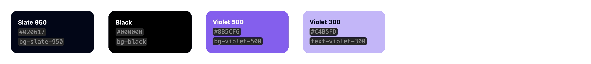
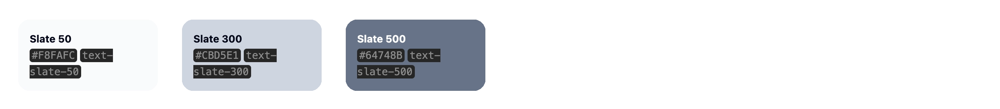
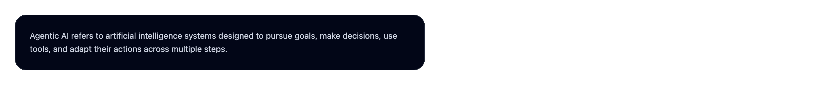
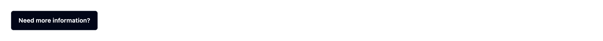
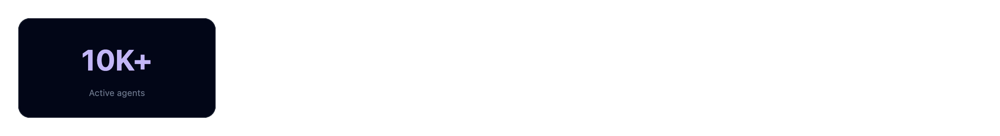
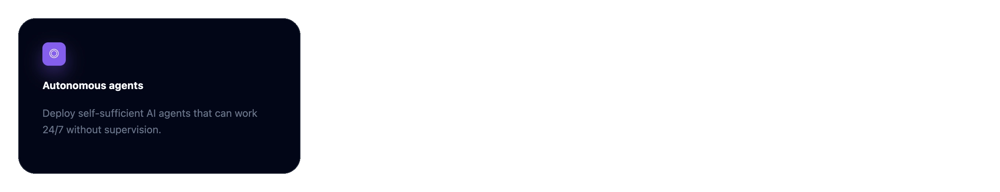
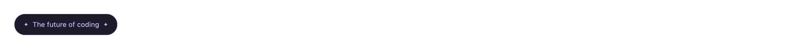

# Style guide

Visual identity and UI guidelines for the Agentic AI landing page.

## 1. Visual identity

The interface follows a modern AI-native visual direction inspired by futuristic SaaS platforms, developer-oriented tools, and immersive dark user interfaces. The overall aesthetic combines strong typography, subtle neon accents, layered depth effects, and spacious layouts to create a premium and modern experience. The design aims to remain clean, readable, technical, and visually immersive while preserving a strong focus on clarity and usability.

## 2. Color palette

### Primary colors



### Text colors



## 3. Typography

### Hero title


#### Tailwind classes

```html
text-5xl md:text-7xl font-black tracking-tight leading-none
```

### Section titles


#### Tailwind classes

```html
text-4xl md:text-5xl font-black tracking-tight leading-none
```

### Body text



#### Tailwind classes

```html
text-sm md:text-base text-slate-300
```

## 4. Layout & spacing

### Container width

```html
max-w-6xl mx-auto px-6
```

### Section spacing

| Usage            | Classes       |
|------------------|---------------|
| Hero section     | `pt-36 pb-24` |
| Standard section | `py-24`       |
| Grid spacing     | `gap-8`       |
| Large spacing    | `mt-12`       |

### Responsive grids

#### Statistics grid

```html
grid grid-cols-2 md:grid-cols-4 gap-8
```

#### Features grid

```html
grid md:grid-cols-3 gap-8
```

#### Gallery grid

```html
grid sm:grid-cols-2 lg:grid-cols-3 gap-8
```

## 5. Buttons

### Primary button


#### Tailwind classes

```html
px-4 py-2 font-semibold rounded-md bg-violet-500 hover:bg-violet-600 shadow-lg shadow-violet-500/40
```

### Secondary button



#### Tailwind classes

```html
px-4 py-2 font-semibold rounded-md border border-slate-800 bg-slate-950 hover:bg-slate-900
```

## 6. Cards

### Statistics card



#### Tailwind classes

```html
p-6 rounded-xl border border-slate-800 bg-slate-950 shadow-xl shadow-slate-950/40
```

### Feature card



#### Tailwind classes

```html
p-8 rounded-3xl border border-slate-800 bg-slate-950 shadow-xl shadow-slate-950/40
```

## 7. Forms

### Input fields


#### Tailwind classes

```html
px-4
py-2
text-slate-50
rounded-md
border
border-slate-800
bg-black
placeholder:text-slate-500
focus:border-violet-500
focus:outline-none
```

## 8. Badges

### Eyebrow



#### Tailwind classes

```html
px-4
py-2
text-xs
text-violet-300
rounded-full
border border-violet-500/20
bg-violet-500/10
```

# 9. Effects & shadows

## Violet glow

```html
shadow-lg shadow-violet-500/40
```

Used for:

- Primary buttons.
- Feature icons.
- Brand identity.
- Highlighted UI elements.

## Surface shadows

```html
shadow-xl shadow-slate-950/40
```

Used for:

- Cards.
- Panels.
- Statistics.
- Forms.

# 10. Background effects

## Gradient Background

The hero and CTA sections combine:

- Radial violet glow.
- Radial blue glow.
- Dark gradients.
- Grid overlays.
- Depth vignettes.

## Grid Overlay

### Tailwind classes

```html
bg-[linear-gradient(to_right,rgba(148,163,184,0.12)_1px,transparent_1px),linear-gradient(to_bottom,rgba(148,163,184,0.12)_1px,transparent_1px)]
bg-[size:72px_72px]
opacity-30
```

# 11. Border radius

| Usage            | Classes        |
|------------------|----------------|
| Buttons          | `rounded-md`   |
| Icon containers  | `rounded-lg`   |
| Statistics cards | `rounded-xl`   |
| Feature cards    | `rounded-3xl`  |
| Badges           | `rounded-full` |

# 12. Responsive design

The project follows a **mobile-first** approach.

## Main breakpoints

| Breakpoint | Usage                    |
|------------|--------------------------|
| `sm:`      | Small layout adjustments |
| `md:`      | Tablet & desktop layouts |
| `lg:`      | Large content grids      |

# 13. Accessibility

The interface should:

- Preserve readable contrast.
- Keep visible hover states.
- Use semantic HTML.
- Associate labels with inputs.
- Remain keyboard accessible.
- Keep readable spacing and typography.

# 14. Overall UI philosophy

The UI should remain:

- Minimal.
- Readable.
- Spacious.
- Immersive.
- Modern.
- Consistent.

The violet accent color should be used carefully to preserve hierarchy and visual impact.