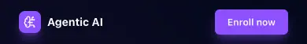

# 1. Header component

Create the **main header** of the landing page.

The goal of this task is to create the **first reusable React component** of the project.

---

- Create a `Header` component in `src/components/Header.jsx`.
    - The component must contain:
        - A brand/logo area.
        - Navigation links.
        - A main call-to-action button or link.

---

- The header must match the provided mockup and [style guide](../../design/style-guide.md).


---

- The navigation links must point to the future corresponding page sections using anchor links.
    - Example:

```text
#about-section
#features-section
#insights-section
#contact-section
```

---

- Use **semantic HTML**.
    - The component must use a `header` element.
    - The navigation section must use a `nav` element.

---

- Use Tailwind CSS to style the component.

---

- The header must be responsive.
    - On smaller screens, the layout must remain readable and visually consistent with the mockup.



---

- Import and render the `Header` component in `src/App.jsx`.

---

- Build and **deploy your project** with GitHub Pages.

---

## Requirements:

- The component must be created in `src/components/Header.jsx`.
- The component must be imported in `src/App.jsx`.
- The component must be rendered at the top (`fixed`) of the application.
- Navigation links must use valid anchor links.
- The call-to-action must be visually identifiable.

**Repo:**

- GitHub repository: `holbertonschool-agentic_ai`.
- Directory: `front_end-frameworks/react/`.
- Files: `src/components/Header.jsx`, `src/App.jsx`.
- Code language: `JavaScript`.