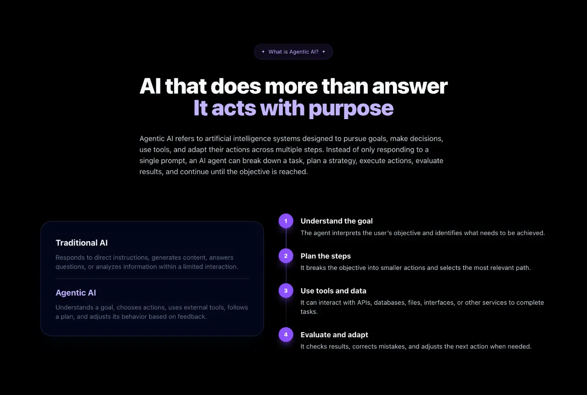
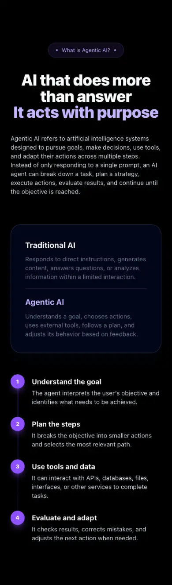

# 3. About section

Create the **about section** of the landing page.

The goal of this task is to continue structuring the application by **importing external data and rendering it dynamically** inside a more detailed section layout.

---

- Create an `About` component in `src/sections/About.jsx`.
    - The component must contain:
        - A small introductory badge (eyebrow).
        - A section title (`h2`).
        - A short introduction text.
        - A steps area.

---

- Create a `steps.js` file in `src/data/steps.js`.
    - The file must export an array of steps.
    - Each step item must contain:
        - A `number`.
        - A `title`.
        - A `description`.

<details>
<summary><b>Example data structure (click to expand)</b></summary>

```javascript
const steps = [
  {
    number: 1,
    title: "Understand the goal",
    description: "The agent interprets the user’s objective and identifies what needs to be achieved."
  },
  {
    number: 2,
    title: "Plan the steps",
    description: "It breaks the objective into smaller actions and selects the most relevant path."
  },
  {
    number: 3,
    title: "Use tools and data",
    description: "It can interact with APIs, databases, files, interfaces, or other services to complete tasks."
  },
  {
    number: 4,
    title: "Evaluate and adapt",
    description: "It checks results, corrects mistakes, and adjusts the next action when needed."
  }
];

export default steps;
```
</details>

---

- Import the steps data into the `About` component.

---

- Render the steps dynamically using `.map()`.

---

- The about section must match the provided mockup and [style guide](../../design/style-guide.md).



---

- Use **semantic HTML**.
    - The section must use a `section` element.

---

- The section must have the following `id`:
    - Example:

```text
about-section
```

---

- Use Tailwind CSS to style the component.

---

- The about section must be responsive.
    - On smaller screens, the layout must remain readable and visually consistent with the mockup.



---

- Import and render the `About` component in `src/App.jsx`.

---

- Build and **deploy your project** with GitHub Pages.

---

## Requirements

- The component must be created in `src/sections/About.jsx`.
- The data file must be created in `src/data/steps.js`.
- The steps data must be imported into `About` component.
- The steps must be rendered dynamically with `.map()`.
- Each step item must display a `number`, a `title` and a `description`.
- The component must be imported in `src/App.jsx`.
- The component must be rendered below the `Hero` component.
- The section must use the `about-section` id.

**Repo:**

- GitHub repository: `holbertonschool-agentic_ai`.
- Directory: `front_end-frameworks/react/`.
- Files: `src/sections/About.jsx`, `src/data/steps.js`, `src/App.jsx`.
- Code language: `JavaScript`.