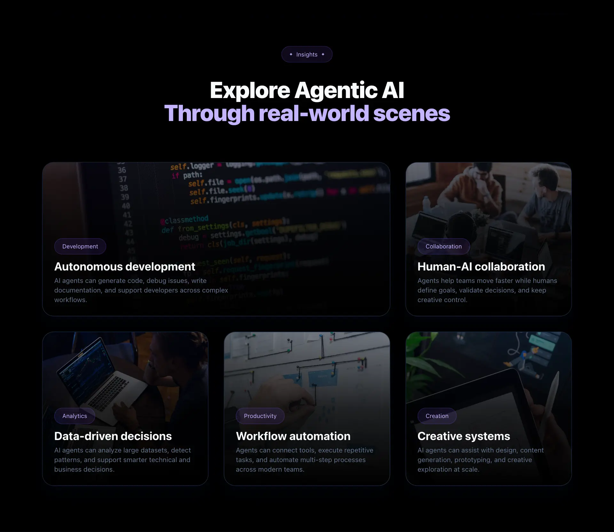

# 5. Insights section

Create the **insights section** of the landing page.

The goal of this task is to **introduce React state**, side effects and a simple service layer to load data asynchronously.

---

- Create an `Insights` component in `src/sections/Insights.jsx`.
    - The component must contain:
        - A small introductory badge (eyebrow).
        - A section title (`h2`).
        - An insights grid.
        - An error message area.

---

- Create an `insights.js` file in `src/data/insights.js`.
    - The file must export an array of insights.
    - Each insight item must contain:
        - A `category`.
        - A `title`.
        - A `description`.
        - An `image`.

<details>
<summary><b>Example data structure (click to expand)</b></summary>

```javascript
const insights = [
  {
    category: "Development",
    title: "Autonomous development",
    description: "AI agents can generate code, debug issues, write documentation, and support developers across complex workflows.",
    image: "https://images.unsplash.com/photo-1515879218367-8466d910aaa4?q=80&w=2369&auto=format&fit=crop&ixlib=rb-4.1.0&ixid=M3wxMjA3fDB8MHxwaG90by1wYWdlfHx8fGVufDB8fHx8fA%3D%3D"
  },
  {
    category: "Collaboration",
    title: "Human-AI collaboration",
    description: "Agents help teams move faster while humans define goals, validate decisions, and keep creative control.",
    image: "https://images.unsplash.com/photo-1522071820081-009f0129c71c?q=80&w=2370&auto=format&fit=crop&ixlib=rb-4.1.0&ixid=M3wxMjA3fDB8MHxwaG90by1wYWdlfHx8fGVufDB8fHx8fA%3D%3D"
  },
  {
    category: "Analytics",
    title: "Data-driven decisions",
    description: "AI agents can analyze large datasets, detect patterns, and support smarter technical and business decisions.",
    image: "https://images.unsplash.com/photo-1579226905180-636b76d96082?q=80&w=1287&auto=format&fit=crop&ixlib=rb-4.1.0&ixid=M3wxMjA3fDB8MHxwaG90by1wYWdlfHx8fGVufDB8fHx8fA%3D%3D"
  },
  {
    category: "Productivity",
    title: "Workflow automation",
    description: "Agents can connect tools, execute repetitive tasks, and automate multi-step processes across modern teams.",
    image: "https://images.unsplash.com/photo-1531403009284-440f080d1e12?q=80&w=2370&auto=format&fit=crop&ixlib=rb-4.1.0&ixid=M3wxMjA3fDB8MHxwaG90by1wYWdlfHx8fGVufDB8fHx8fA%3D%3D"
  },
  {
    category: "Creation",
    title: "Creative systems",
    description: "AI agents can assist with design, content generation, prototyping, and creative exploration at scale.",
    image: "https://images.unsplash.com/photo-1558655146-605d86ed31b3?q=80&w=1364&auto=format&fit=crop&ixlib=rb-4.1.0&ixid=M3wxMjA3fDB8MHxwaG90by1wYWdlfHx8fGVufDB8fHx8fA%3D%3D"
  }
];

export default insights;
```
</details>

---

- Create a reusable `InsightCard` component in `src/components/InsightCard.jsx`.

---

- Create an `insightsService.js` file in `src/services/insightsService.js`.
  - The service must import the insights data.
  - The service must export an asynchronous `getInsights` function.
  - The `getInsights` function must return the insights data.

---

- Import `getInsights` into the `Insights` component.

---

- Render the insights dynamically using `.map()`.

---

- Pass the insight data to `InsightCard` using props.

---

- The `index` must also be passed as a prop to `InsightCard`.

---

- The first insight card must use a different layout style.

---

- Use `useState` to store:
  - The insights list.
  - An error message.

---

- Use `useEffect` to load the insights when the component is rendered.

---

- Use `async` / `await` to call `getInsights`.

---

- Handle loading errors with `try` / `catch`.

---

- The insights section must match the provided mockup and style guide.



---

- Use **semantic HTML**.
  - The section must use a `section` element.
  - Each insight card must use an `article` element.

---

- The section must have the following `id`:
  - Example:

```text
insights-section
```

---

- Use **Tailwind CSS** to style the component.

---

- The insights section must be responsive.
  - On smaller screens, the layout must remain readable and visually consistent with the mockup.


---

- Import and render the Insights component in `src/App.jsx`.

---

- Build and **deploy your project** with GitHub Pages.

---

## Requirements

- The component must be created in `src/sections/Insights.jsx`.
- The reusable card component must be created in `src/components/InsightCard.jsx`.
- The data file must be created in `src/data/insights.js`.
- The service file must be created in `src/services/insightsService.js`.
- The insights data must be loaded through `getInsights`.
- The component must use `useState`.
- The component must use `useEffect`.
- The data loading logic must use `async` / `await`.
- Loading errors must be handled with `try` / `catch`.
- The insights must be rendered dynamically with `.map()`.
- Insight data must be passed to `InsightCard` using props.
- The `index` must be passed to `InsightCard` using props.
- The first insight card must use a different layout style.
- Each insight card must display a `category`, a `title`, a `description` and an `image`.
- Each insight card must use an `article` element.
- The component must be imported in `src/App.jsx`.
- The component must be rendered below the `Features` component.
- The section must use the `insights-section` id.

---

**Repo:**

- GitHub repository: `holbertonschool-agentic_ai`.
- Directory: `front_end-frameworks/react/`.
- Files: `src/sections/Insights.jsx`, `src/components/InsightCard.jsx`, `src/data/insights.js`, `src/services/insightsService.js`, `src/App.jsx`.
- Code language: `JavaScript`.