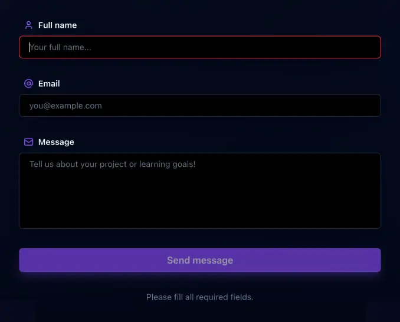
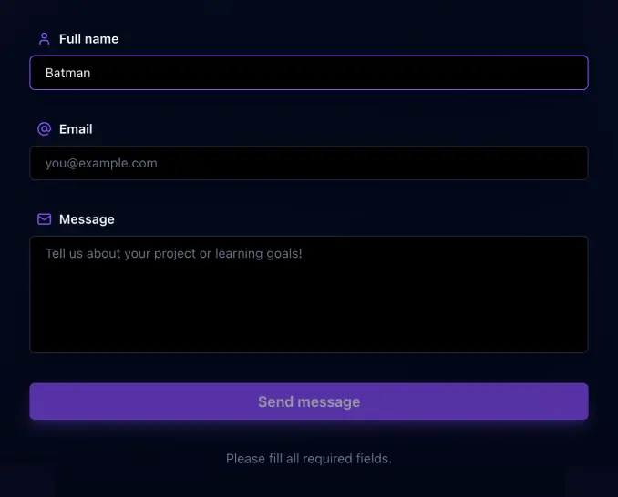
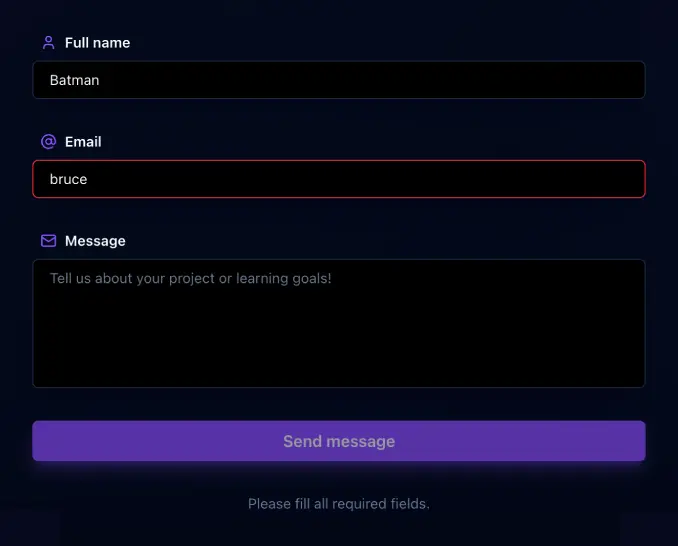
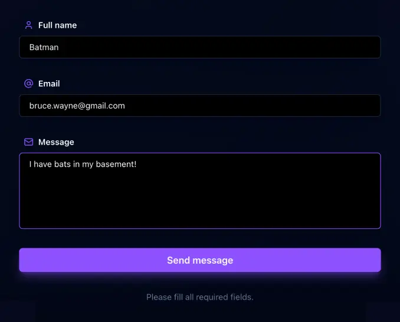
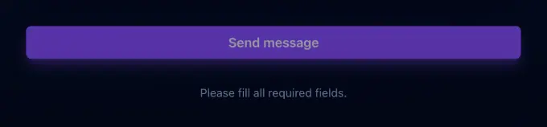
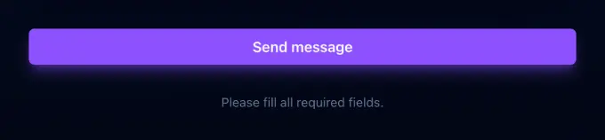
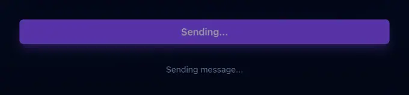
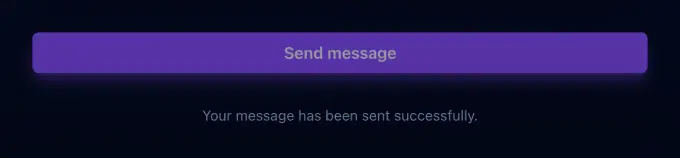
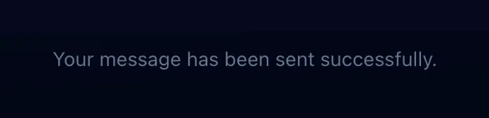

# 6. Contact section

Create the **contact section** of the landing page.

The goal of this task is to build an interactive contact section using **React state**, controlled inputs, frontend validation and dynamic user feedback.

- Create a `Contact` component in `src/sections/Contact.jsx`.
    - The component must contain:
        - A small introductory badge (eyebrow).
        - A section title (`h2`).
        - A primary call-to-action link.
        - A secondary call-to-action link.
        - A short list of highlights with icons.
        - A contact form.
        - A feedback message area.

---

- Import the required icons from `lucide-react`.
   - The section must use icons for:
        - Project-based learning.
        - Peer learning environment.
        - AI-powered workflows.
        - Full name.
        - Email.
        - Message.

---

- The contact form must contain:
    - A full name field.
    - An email field.
    - A message field.
    - A submit button.

---

- Use `useState` to manage:
    - The form data.
    - The sending state.
    - The feedback message.

---

- Use controlled inputs.
    - Each form field must:
        - Have a `value` linked to the form state.
        - Update the form state when the user types.
        - Disable browser autocomplete.

---

- Add basic frontend validation.
    - The form must only be valid when:
        - The full name contains at least 2 characters.
        - The email contains `@` and `.`.
        - The message contains at least 10 characters.

_This validation is intentionally basic for learning purposes. In a real-world project, user input must also be validated and sanitized on the backend to prevent security issues such as invalid data, spam, injection attacks or malicious payloads._

---

- Use dynamic styling for form fields.
    - When a field is focused:
        - Invalid fields must use a red border.
        - Valid fields must use a violet border.

<table align="center">
    <tr>
        <th align="center" style="text-align: center;">Invalid</th>
        <th align="center" style="text-align: center;">Valid</th>
        <th align="center" style="text-align: center;">Invalid edited field</th>
        <th align="center" style="text-align: center;">Validated form</th>
    </tr>
    <tr valign="top">
        <td align="center" width="25%">
            
        </td>
        <td align="center" width="25%">
            
        </td>
         <td align="center" width="25%">
            
        </td>
         <td align="center" width="25%">
            
        </td>
    </tr>
</table>

---

- Disable the submit button while:
    - The form is invalid.
    - The message is being sent.

---

- Simulate a message submission.
    - The submit handler must:
        - Prevent the default form behavior.
        - Use an asynchronous function.
        - Simulate a short delay before confirming submission.
        - Reset the form after a successful submission.

<table align="center">
    <tr>
        <th align="center" style="text-align: center;">Required fields</th>
        <th align="center" style="text-align: center;">Ready to send</th>
        <th align="center" style="text-align: center;">Sending</th>
        <th align="center" style="text-align: center;">Message sent</th>
    </tr>
    <tr valign="top">
        <td align="center" width="25%">
            
        </td>
        <td align="center" width="25%">
            
        </td>
         <td align="center" width="25%">
            
        </td>
         <td align="center" width="25%">
            
        </td>
    </tr>
</table>

---

- Display dynamic feedback below the submit button.
    - The feedback message must:
        - Display a default instruction message.
        - Change while the message is being sent.
        - Change after a successful submission.
        - Return to the default message after a short delay.

<table align="center">
    <tr>
        <th align="center" style="text-align: center;">Required fields</th>
        <th align="center" style="text-align: center;">Sending</th>
        <th align="center" style="text-align: center;">Message sent</th>
    </tr>
    <tr valign="top">
        <td align="center" width="25%">
            
        </td>
        <td align="center" width="25%">
            
        </td>
         <td align="center" width="25%">
            
        </td>
    </tr>
</table> 

---

- The contact section must match the provided mockup and [style guide](../../design/style-guide.md).


---

- Use **semantic HTML**.
    - The section must use a `section` element.
    - The form must use a `form` element.
    - Each field must use a `label`.
    - Each `label` must be associated with its corresponding field.

---

- The section must have the following `id`:
    - Example:

```text
contact-section
```

---

- External links must open in a new tab.

---

- External links must use the appropriate security attributes.

---

- Use Tailwind CSS to style the component.

---

- The contact section must be responsive.
    - On smaller screens, the layout must remain readable and visually consistent with the mockup.


---

- Import and render the `Contact` component in `src/App.jsx`.

---

- Build and **deploy your project** with GitHub Pages.

---

## Requirements

- The component must be created in `src/sections/Contact.jsx`.
- The component must import icons from `lucide-react`.
- The component must use `useState`.
- The form must use controlled inputs.
- Browser autocomplete must be disabled on the form fields.
- The form must contain a full name field, an email field, a message field and a submit button.
- The form submission must be handled in React.
- The page must not reload when the form is submitted.
- The submit button must be disabled while the form is invalid.
- The submit button must be disabled while the message is being sent.
- The submission must be simulated with an asynchronous delay.
- A feedback message must be displayed below the submit button.
- The feedback message must update dynamically depending on the form state.
- Each form field must have an associated label and icon.
- External links must open in a new tab.
- External links must use `rel="noopener noreferrer"`.
- The component must be imported in `src/App.jsx`.
- The component must be rendered below the `Insights` component.
- The section must use the `contact-section` id.

**Repo:**

- GitHub repository: `holbertonschool-agentic_ai`.
- Directory: `front_end-frameworks/react/`.
- Files: `src/sections/Contact.jsx`, `src/App.jsx`.
- Code language: `JavaScript`.