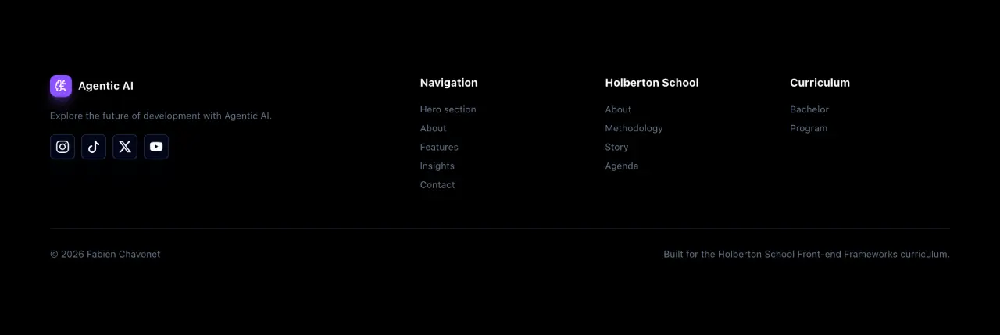
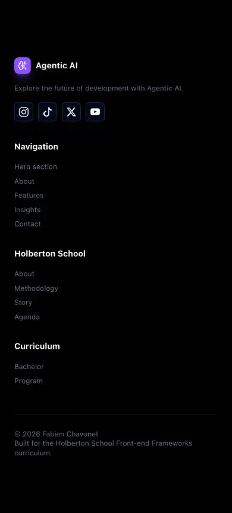

# 7. Footer section

Create the **footer section** of the landing page.

The goal of this task is to **complete the page layout** with a structured footer containing navigation links, external links, social links and dynamic year rendering.

---

- Create a `Footer` component in `src/components/Footer.jsx`.
    - The component must contain:
        - A brand/logo area (same as the header).
        - A short description.
        - Social media links.
        - Internal navigation links.
        - External Holberton School links.
        - Curriculum links.
        - A copyright area.

---

- Import the required icon from `lucide-react`.
    - The brand/logo area must use a **Lucide React** icon.

---

- Add social media links.
    - The social media links must include:
        - **Instagram**.
        - **TikTok**.
        - **X**.
        - **YouTube**.
    - Each social media link must:
        - Open in a new tab.
        - Use the appropriate security attributes.
        - Have an accessible `aria-label`.

---

- Add internal navigation links.
    - The internal navigation links must point to the corresponding page sections:

```text
#hero-section
#about-section
#features-section
#insights-section
#contact-section
```

---

- Add external links.
    - External links must point to Holberton School and curriculum-related resources.
    - External links must open in a new tab.
    - External links must use the appropriate security attributes.

---

- Display the current year **dynamically**.
    - The year must be generated using JavaScript.
    - The year must not be hardcoded.

---

- The footer section must match the provided mockup and [style guide](../../design/style-guide.md).



---

- Use **semantic HTML**.
    - The footer must use a `footer` element.
    - Link groups must use list elements when relevant.

---

- Use Tailwind CSS to style the component.

---

- The footer section must be responsive.
    - On smaller screens, the layout must remain readable and visually consistent with the mockup.



---

- Import and render the `Footer` component in `src/App.jsx`.

- Build and **deploy your project** with GitHub Pages.

## Requirements

- The component must be created in `src/components/Footer.jsx`.
- The component must import an icon from `lucide-react`.
- The footer must contain a brand/logo area.
- The footer must contain social media links.
- Social media links must have accessible `aria-label` attributes.
- Internal navigation links must use valid anchor links.
- External links must open in a new tab.
- External links must use `rel="noopener noreferrer"`.
- The current year must be displayed dynamically.
- The component must be imported in `src/App.jsx`.
- The component must be rendered below the `Contact` component.

---

**Repo:**

- GitHub repository: `holbertonschool-agentic_ai`.
- Directory: `front_end-frameworks/react/`.
- Files: `src/components/Footer.jsx`, `src/App.jsx`.
- Code language: `JavaScript`.