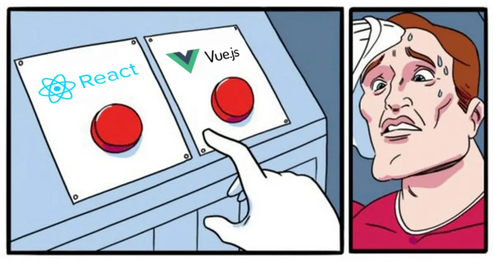

# Front-end - Frameworks : Vue.js

## Description

---

This project introduces **Vue.js** through a practical framework migration exercise.

Building upon the **React** application developed during the previous project, you will progressively recreate the same interface using **Vue.js** while preserving the original functionality, structure and user experience.

Using two implementations of the same application as a reference, this project focuses on understanding how modern frontend frameworks solve similar problems through different syntaxes, patterns and development approaches.

By comparing the **React** and **Vue.js** versions of the application, you will explore:

- Component architecture.
- Data flow.
- Reactive rendering.
- State management.
- Lifecycle management.
- Templating systems.
- Development workflows.
- AI-assisted framework migration.

Unlike the previous project, **AI-assisted development tools are allowed and encouraged**.

The purpose of this project is **not to evaluate your ability to manually rewrite an entire codebase**, but rather your ability to **understand, analyze and learn** from AI-assisted framework migration workflows.

At the end of the project, you should be able to identify and explain the major **similarities and differences** between **React** and **Vue.js**, understand the concepts shared by both frameworks, and recognize how different tools can be used to achieve the same frontend objectives.

Throughout the project, particular attention should be given to understanding the generated Vue.js code and comparing it with the original React implementation.

A **final assessment** (quiz) will evaluate your understanding of **Vue.js** concepts, framework architecture, and the similarities and differences between **React** and **Vue.js**.

---

## Resources

#### Read or watch:

- [Vue.js documentation](https://vuejs.org/guide/quick-start.html)
- [Vue.js Essentials](https://vuejs.org/guide/essentials/application.html)
- [Vue.js Tutorial](https://vuejs.org/tutorial/)
- [Apprendre Vue.js (FR)](https://grafikart.fr/formations/vuejs)
- [Vite documentation](https://vite.dev/guide/)
- [Tailwind CSS documentation](https://tailwindcss.com/docs/installation/using-vite)
- [Lucide Vue documentation](https://lucide.dev/guide/packages/lucide-vue-next)
- [ESLint documentation](https://eslint.org/docs/latest/)
- [GitHub Pages documentation](https://docs.github.com/en/pages)

---

## Learning objectives

At the end of this project, you are expected to be able to explain to anyone, **without the help of Google**:

#### General

- _What is Vue.js._
- _What is a frontend framework._
- _Why multiple frontend frameworks exist._
- _Why frontend frameworks share similar concepts._
- _Why frontend frameworks use different syntaxes._

#### Vue.js

- _What is a Vue component._
- _What is a Single File Component (SFC)._
- _What is the Composition API._
- _What is a ref._
- _What is reactive data._
- _What is v-model._
- _What is v-for._
- _What is v-if._
- _What is onMounted._
- _How Vue.js reactivity works._
- _How to create Vue components._
- _How to organize a Vue project._
- _How to manage reactive state._
- _How to bind data to the UI._
- _How to handle user interactions._
- _How to render dynamic content._

#### React vs Vue.js

- _Similarities between React and Vue.js._
- _Differences between React and Vue.js._
- _JSX versus Vue templates._
- _Props in React versus props in Vue._
- _useState versus ref._
- _useEffect versus onMounted._
- _Conditional rendering in React versus Vue._
- _Dynamic rendering in React versus Vue._
- _Event handling in React versus Vue._
- _Form management in React versus Vue._
- _Project organization in React versus Vue._

#### AI-assisted Development

- _How AI can assist framework migration._
- _How to review AI-generated code._
- _How to validate AI-generated code._
- _Why understanding generated code remains essential._

---

## Requirements

- **AI-assisted development tools are allowed**.
- A `README.md` file is mandatory at the root of the repository.
- Your project must use **Vue.js** with **Vite**.
- Your project must use **JavaScript**.
- Your project must use **Tailwind CSS**.
- Your project must use **Lucide Vue**.
- **No external CSS framework** allowed except Tailwind CSS.
- All files should **end with a new line**.
- **No inline styles** allowed.
- The final application must remain **visually and functionally equivalent** to the React version.
- Your project must run locally.
- Your project must build successfully.