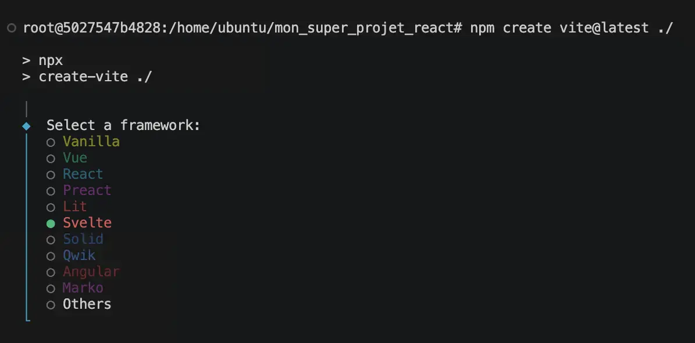

# 0. Project setup

Set up the initial **Svelte** application using **Vite**.

The goal of this task is to create a **clean Svelte project foundation** that will be used for all the following tasks.

This task **intentionally follows the same principles** and overall workflow as the **project setup tasks from the previous React and Vue.js projects**. You will go through a very similar setup process while discovering how the Svelte ecosystem approaches project initialization, configuration and tooling.

---

- Create a Svelte project with Vite in the `front_end-frameworks/svelte/` directory.
    - Use the **Svelte** framework and the **JavaScript** variant during the project initialization.

<table align="center">
    <tr valign="top">
        <td align="center">
            
        </td>
        <td align="center">
            
        </td>
    </tr>
</table>

*You can refer to the official [Tailwind CSS documentation](https://tailwindcss.com/docs/installation/using-vite) to properly configure Svelte and Tailwind CSS with Vite.*

---

- Configure the project with the **required tools and packages** for the rest of the curriculum.
    - The project must include:
        - Tailwind CSS.
        - Lucide Svelte.
        - ESLint.

---

* Clean the default **Vite** files and **remove unused assets**.

---

- The final project configuration must allow:
    - The application to run on port 3000.
    - The development server to use the host `0.0.0.0`.
    - Tailwind CSS to work correctly.
    - Lucide Svelte to be used inside components.
    - ESLint checks to pass correctly.
    - The project to build for production.
    - Deployment using GitHub Pages.

---

- Create a **temporary homepage** in `src/App.svelte`.
  - The homepage must contain:
    - A main title (`h1`).
    - A short subtitle (`h2`).
    - At least one Lucide Svelte icon.
    - Basic styling with Tailwind CSS.

_This temporary homepage is only used to verify that the project is correctly configured._

---

## Requirements

- Remove unused default assets.
- The project must contain a `src/global.css` file.
- The project must import `global.css` in `src/main.js`.
- The project must include working `dev`, `lint`, `fix`, `build`, `preview` scripts.
- The application must **run correctly** in development mode.
- The project **must build successfully** for production.
- The temporary homepage must be displayed correctly.

**Repo:**

- GitHub repository: `holbertonschool-agentic_ai`.
- Directory: `front_end-frameworks/svelte/`
- File: `src/global.css`, `src/App.svelte`, `src/main.js`, `eslint.config.js`, `index.html`, `package.json`, `vite.config.js`, `.gitignore`, `README.md`.
- Code language: `Svelte`, `JavaScript`.
