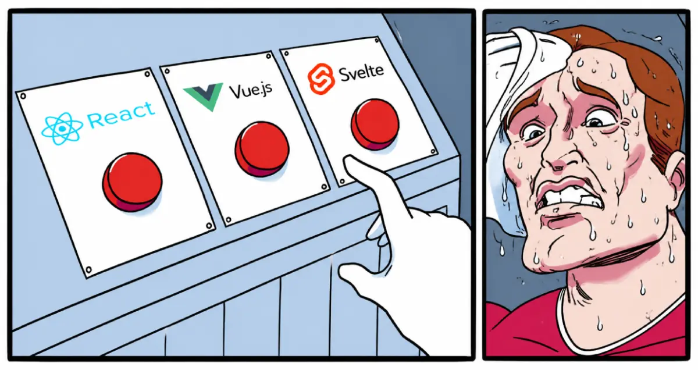

# Front-end - Frameworks : Svelte

## Description

---

This project introduces **Svelte** through a practical framework migration exercise.

Building upon the **React** application developed during the first project and the **Vue.js** version created during the previous project, you will progressively recreate the same interface using **Svelte** while preserving the original functionality, structure and user experience.

This project **may feel intentionally** close to the previous Vue.js migration project, both in its structure and in its objectives.
### The repetition is part of the learning process.
The goal is **not only to discover another frontend framework**, but also to demonstrate how a **well-structured project can be migrated efficiently** from one modern framework to another with the help of AI-assisted development tools.

By comparing the **React**, **Vue.js** and **Svelte** versions of the same application, you will better understand how modern frontend frameworks solve similar problems through different syntaxes, patterns and development approaches.

This project focuses on:

- Component architecture.
- Data flow.
- Reactive rendering.
- State management.
- Lifecycle management.
- Template syntax.
- Development workflows.
- AI-assisted framework migration.

Unlike the first React project, **AI-assisted development tools are allowed and encouraged**.

The purpose of this project is **not to evaluate your ability to manually rewrite an entire codebase**, but rather your ability to **understand, analyze, validate and improve** an AI-assisted framework migration.

In modern frontend development, **knowing one specific framework is important**, but it is no longer the only valuable skill.
 
A developer who deeply understands component-based architecture, data flow, reactivity, debugging, code quality and AI-assisted workflows can adapt much faster to a new framework or codebase.

This project is designed to show you that **being a React, Vue.js or Svelte developer should not prevent you from contributing to a project using another frontend framework**.
 
If the original project is **clean, well-structured** and understandable, **AI can help produce high-quality conversions** quickly.

However, **AI does not replace understanding**.
 
You must still be able to read the generated code, identify mistakes, debug issues, compare implementations and explain the differences between frameworks.

At the end of the project, you should be able to identify and explain the major **similarities and differences** between **React**, **Vue.js** and **Svelte**, understand the concepts shared by these frameworks, and recognize how AI-assisted development can help you move efficiently between frontend ecosystems.

Throughout the project, particular attention should be given to understanding the generated Svelte code and comparing it with the previous React and Vue.js implementations.

A **final assessment** (quiz) will evaluate your understanding of **Svelte** concepts, framework architecture, and the similarities and differences between **React**, **Vue.js** and **Svelte**.

---

## Resources

#### Read or watch:

- [Svelte documentation](https://svelte.dev/docs)
- [Svelte tutorial](https://svelte.dev/tutorial)
- [Svelte introduction](https://svelte.dev/docs/svelte/overview)
- [Svelte reactivity](https://svelte.dev/docs/svelte/what-are-runes)
- [Vite documentation](https://vite.dev/guide/)
- [Tailwind CSS documentation](https://tailwindcss.com/docs/installation/using-vite)
- [Lucide Svelte documentation](https://lucide.dev/guide/packages/lucide-svelte)
- [ESLint documentation](https://eslint.org/docs/latest/)
- [GitHub Pages documentation](https://docs.github.com/en/pages)

---

## Learning objectives

At the end of this project, you are expected to be able to explain to anyone, **without the help of Google**:

#### General

- _What is Svelte._
- _What is a frontend framework._
- _Why multiple frontend frameworks exist._
- _Why frontend frameworks share similar concepts._
- _Why frontend frameworks use different syntaxes._
- _How framework migration can be assisted by AI._
- _Why code structure matters when migrating a project._

#### Svelte

- _What is a Svelte component._
- _What is a `.svelte` file._
- _What is reactive rendering in Svelte._
- _What is a reactive variable._
- _What is a prop in Svelte._
- _What is `$props()`._
- _What is `$state()`._
- _What is `bind:value`._
- _What is `{#each}`._
- _What is `{#if}`._
- _What is `onMount`._
- _How Svelte reactivity works._
- _How to create Svelte components._
- _How to organize a Svelte project._
- _How to manage reactive state._
- _How to bind data to the UI._
- _How to handle user interactions._
- _How to render dynamic content._

#### React vs Vue.js vs Svelte

- _Similarities between React, Vue.js and Svelte._
- _Differences between React, Vue.js and Svelte._
- _JSX versus Vue templates versus Svelte templates._
- _Props in React versus props in Vue.js versus props in Svelte._
- _useState versus ref versus `$state()`._
- _useEffect versus onMounted versus onMount._
- _Conditional rendering in React versus Vue.js versus Svelte._
- _Dynamic rendering in React versus Vue.js versus Svelte._
- _Event handling in React versus Vue.js versus Svelte._
- _Form management in React versus Vue.js versus Svelte._
- _Project organization in React versus Vue.js versus Svelte._

#### AI-assisted Development

- _How AI can assist framework migration._
- _How to write useful prompts for code migration._
- _How to review AI-generated code._
- _How to validate AI-generated code._
- _How to compare generated code with the original implementation._
- _How to debug AI-generated code._
- _Why understanding generated code remains essential._
- _Why AI-assisted development can reduce the barrier between different frontend ecosystems._

---

## Requirements

* **AI-assisted development tools are allowed**.
* A `README.md` file is mandatory at the root of the repository.
* Your project must use **Svelte** with **Vite**.
* Your project must use **JavaScript**.
* Your project must use **Tailwind CSS**.
* Your project must use **Lucide Svelte**.
* **No external CSS framework** allowed except Tailwind CSS.
* All files should **end with a new line**.
* **No inline styles** allowed.
* The final application must remain **visually and functionally equivalent** to the React and Vue.js versions.
* Your project must run locally.
* Your project must build successfully.

---

## More information

#### Project continuity

This project is part of a progressive frontend framework sequence:

* The **React** project introduces component-based frontend development without AI-assisted code generation.
* The **Vue.js** project introduces a first AI-assisted framework migration.
* The **Svelte** project reinforces this migration workflow with a third implementation of the same interface.

The objective is to help you understand that modern frontend frameworks often share the same core ideas, even when their syntax and tooling are different.

- A clean original project is easier to migrate.
- A well-organized component structure makes AI-assisted conversion more reliable.
- A developer who understands the code remains essential to validate, improve and debug the result.